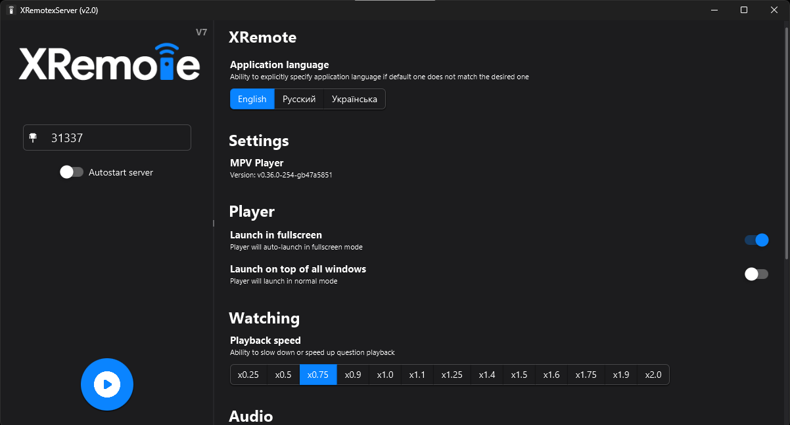

<p align="center">
  
</p>

## What it this?

Cross-platform `Java + JavaFX` application that work's as `remote server` for `casting` videos from supported client apps. It's like `Chromecast` but designed to be used on local network with [AniLabX](https://github.com/AniLabX) ecosystem in mind

*Note: video content itself is not sent over the network. Client only sends a link to video with additional metadata and server will play video directly*

App can be used on `Windows`, `Linux` and `MacOS`, and released in `binary` builds for each platform and single cross-platform `JAR` file

App consist of separate modules that work together for best user experience:
- `XRemote×Server` - core of the server. Used for low-level communication with `XRemote×Client` instances using `Socket`
- `XRemote×Client` - client implementation for communication with `XRemote×Server`. *Not used in this project*
- `XRemote×Remote` - for remote player controlling (`Play`/`Pause`/`Stop`/`Seek`/`Volume`/`Metadata`, etc)
- `XRemote×Discovery` - uses multicasting ([Zeroconf/Bonjour](https://en.wikipedia.org/wiki/Bonjour_(software)) protocol) that allows server to be discovered by clients over the network

<p align="center">
  
</p>

## Clients

For now, only [AniLabX (Android)](https://github.com/CrazyXacker/anilabx) as client is supported

Also, `AniLabX` implements both `XRemote×Server` and `XRemote×Client` functionalities, that allows creating server from one app instance and using another instance as client. It may be useful in cases where you're using `AniLabX` on `Android TV` for watching and on `Android` phone/tablet for playback controlling

## Prerequisites

### JAR version

Download and install any `JRE 17+` version. I prefer [GraalVM 17](https://www.graalvm.org/downloads/)

### Binary version

#### Windows

Install [Microsoft Visual C++ 2010 (x64)](https://www.microsoft.com/en-US/download/details.aspx?id=26999) and [Microsoft Visual C++ 2015 (x64)](https://www.microsoft.com/en-US/download/details.aspx?id=53840)

#### Linux

Additional libs are not required, but make sure to mark file as executable:  
```chmod +x XRemote```

#### MacOS
Additional libs are not required, but make sure to remove Apple quarantine attribute:  
```sudo xattr -d com.apple.quarantine XRemote```  
and mark file as executable:  
```chmod +x XRemote```

## Installation and launching

*Note: `binary` version of app will work only on `x86_64` systems (and, maybe, on `ARM Mac` with `Rosetta`)! `JAR` version is [WORA](https://en.wikipedia.org/wiki/Write_once,_run_anywhere)*

- Download latest binary file for your system from [Release](https://github.com/CrazyXacker/XRemoteDesktop/releases)
- Put it in desired location (*Note: it can be launched from any location, but app will create /bin folder next to itself*)
- Refer to **Prerequisites** section and read info about how to prepare for launch on your system
- Launch as normal app by double-clicking or in `Terminal` with ```./XRemote``` command for `binary` version or with ```java -jar Xremote.jar``` command for `JAR` version

### Configuration

App UI is self-explanatory and consist of few server configuration fields, player configuration section and `Start`/`Stop` button

#### Server configuration

There is only one text field for server `Port` defining and switch that allow server autostart on app launch. Default `31337` port should be fine for almost all users

#### Player configuration

App rely on `MPV` for video watching. You will be prompted to install `MPV` if app will not find it on system

There is player configuration section on right side of app that will help you change default behavior, but predefined settings should be fine for almost all users

#### How to start and stop

Just hit `Start`/`Stop` button

### How to connect

In `XRemote×Client`-powered client (for example, [AniLabX (Android)](https://github.com/CrazyXacker/anilabx)) find `XRemote` section and add new server using `IP` and `Port` from this app after server launching. After that you can send video to server from application UI

If `XRemote×Client`-powered client supports `XRemote×Discovery` service, it may show available servers with fast connection ability in local network, for example, in player UI. In that case, there is no need to add `XRemote×Server` by hand

*Note: after starting server you will see only one `IP` from first network interface. In some cases, it can be wrong (for example, ip from `VMWare` network interface). You can see all available `IPs` in logs and find correct one*

## Building

Refer to [Building](https://github.com/AniLabX/XRemoteDesktop/blob/main/BUILDING.md) guide